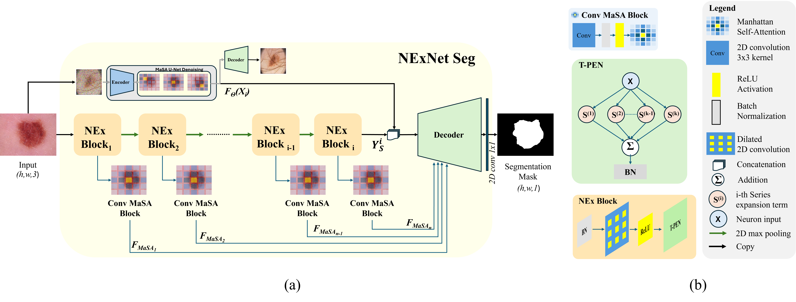

# NExNet_Seg
We introduce NExNet Seg, the Neuron Expansion Network for Medical Image Segmentation. Inspired by Progressively Expanded Neu- ron (PEN) structures and Manhattan Self-Attention (MaSA) mechanisms, NExNet Seg achieves exceptional accuracy with high parameter efficiency.

  <figure>
    
    <figcaption>Illustration of the proposed NExNet Seg architecture for medical image segmentation. (a) NExNet Seg combines T-PEN and MaSA concepts. (b) T-PEN is embedded into the NEx blocks, while MaSA is combined with traditional convolution within the Conv MaSA block.</figcaption>
  </figure>

# UNDER CONSTRUCTION
### In the mean time here is a picture of a 

  <figure>
    
    <figcaption>Happy quokka.</figcaption>
  </figure>

## License
See the [LICENSE](LICENSE.md) file for license rights and limitations (MIT).

